# Signer and Sign Verifier

## Author

- Yuluka Gigante Muriel


## Overview

This repository provides an implementation of a digital signature application, enabling secure file signing and signature verification using RSA cryptography. It is designed to offer both functionality and flexibility, catering to different user needs.

**Key features:**

1. **_RSA Key Generation:_** Create secure RSA key pairs for signing, encryption, and decryption.
2. **_Private Key Protection:_** Encrypt (lock) the private key with a password for enhanced security.
3. **_Private Key Access:_** Decrypt (unlock) the locked private key using the correct password.
4. **_File Signing:_** Generate digital signatures for files using your private key.
5. **_Signature Verification:_** Validate file signatures with the corresponding public key.

Keys can be generated in two ways: 1) using OpenSSL commands, or 2) using a manual implementation of the RSA algorithm.


## How to use it

To use this project you must follow these steps:

1. Install the dependencies listed in `requirements.txt`:

    ```bash
    pip install -r requirements.txt
    ```

2. Run the `start_ui.py` script:

    To start the application, run the following command:

    ```bash
    streamlit run .\src\start_ui.py
    ```

3. Navigate through the application:

    Once the application is running, it will open in your browser and should look like this:

    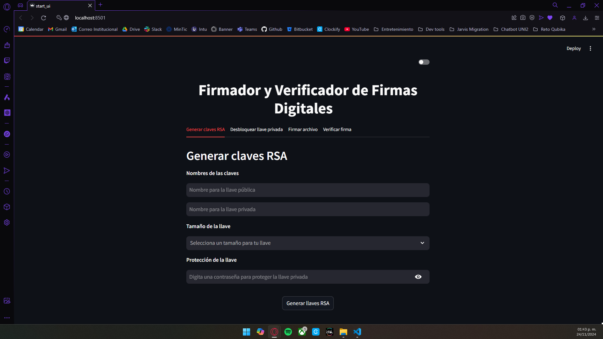

    The application is composed by 4 tabs:

    1. `Generar claves RSA`: 

        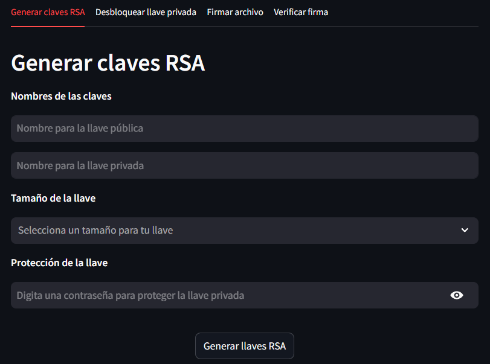

        In this tab you can create RSA key pairs. 
        
        To do that, just fill all the fields, and press `Generar llaves RSA` button. Once you do that, the program will use the selected mode to generate the RSA key pairs (default is using OpenSSL).

        **Note**: If yo want to use the manual RSA algorithm in the keys generation, press the toggle button in the upper right corner:

        

        Press it again if you want to switch back to the default mode (OpenSSL):

        

        When the keys have been generated, you will see the button `Descargar llaves`:

        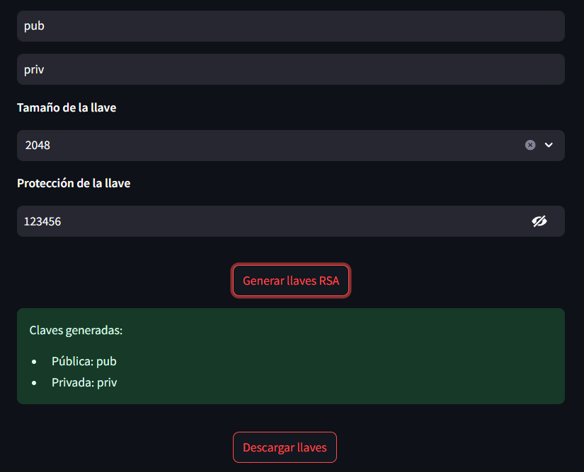

        Click it to download the generated keys:

        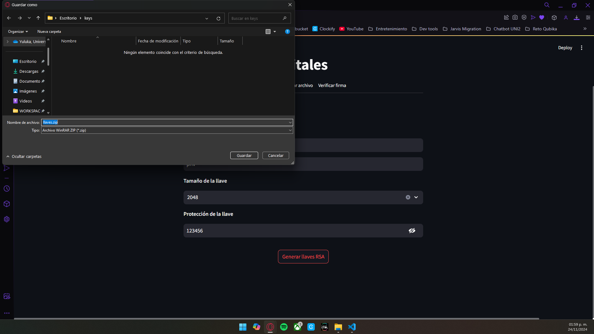

    2. `Desbloquear llave privada`

        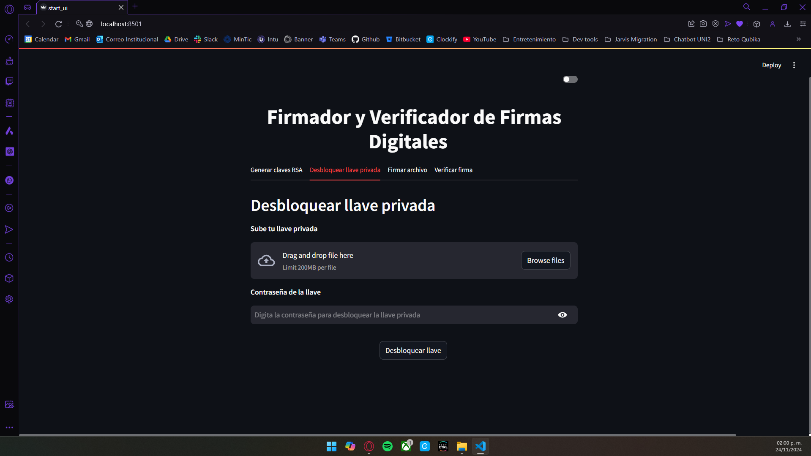

        In this tab you can unlock the previously generated (and locked) private key.

        To do that, just upload the private key file, and type the password you used to lock it. After that, press the button `Desbloquear llave`. The process will start and, when your key is ready, you will see the button `Descargar llave`:

        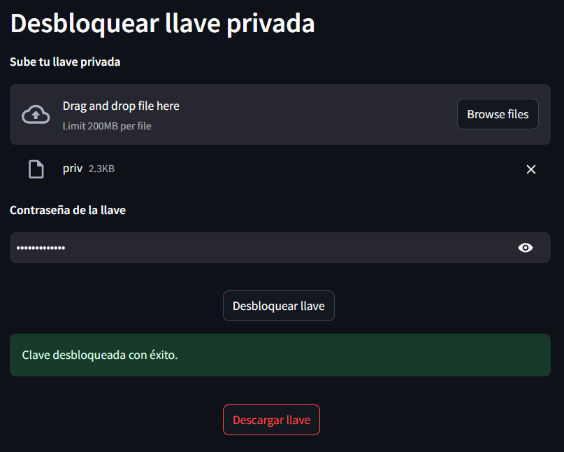

        Click it to download the unlocked key:

        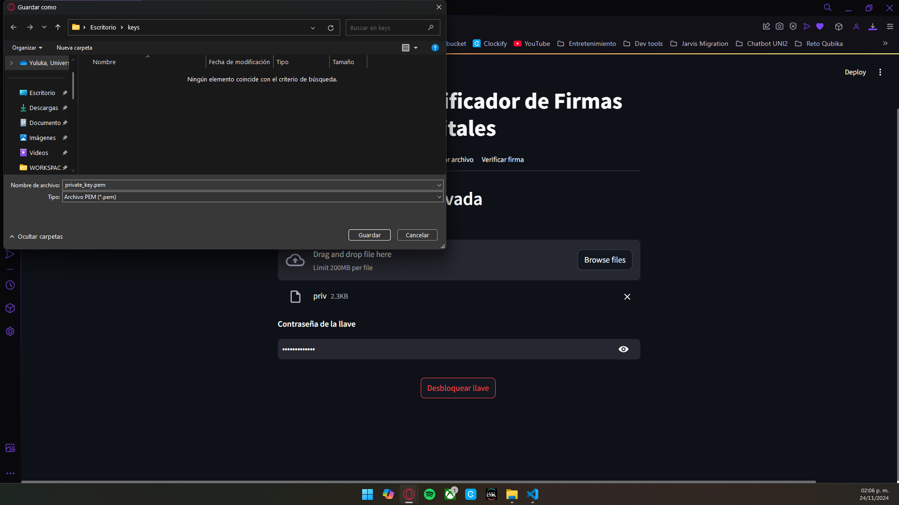

    3. `Firmar archivo`:

        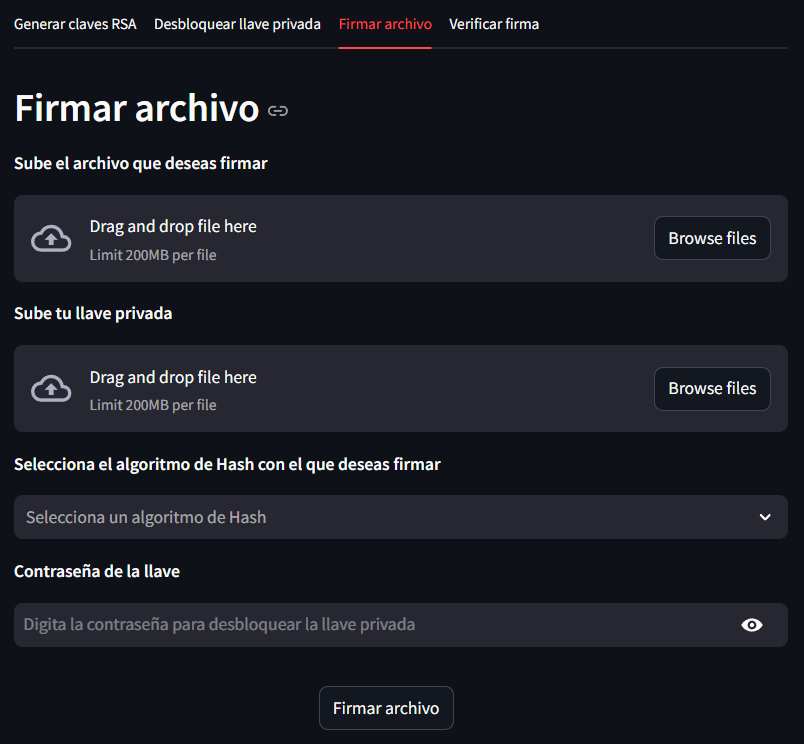
        
        In this tab you can generate a digital signature for a file with your private key.

        To do that, just upload the file you want to sign, your previously generated and locked key, select the hash algorithm you want to use and enter the password you used to lock the key. After that, press the button `Firmar archivo`. The process will start and, when your key is ready, you will see the button `Descargar firma`:

        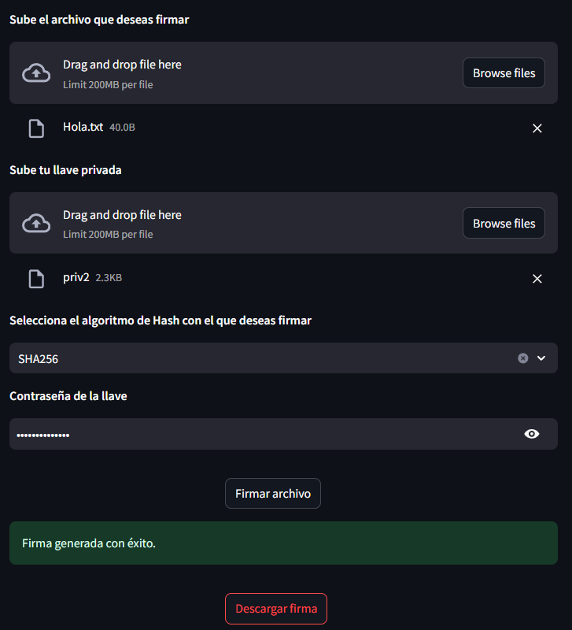

        Click it to download the generated signature:

        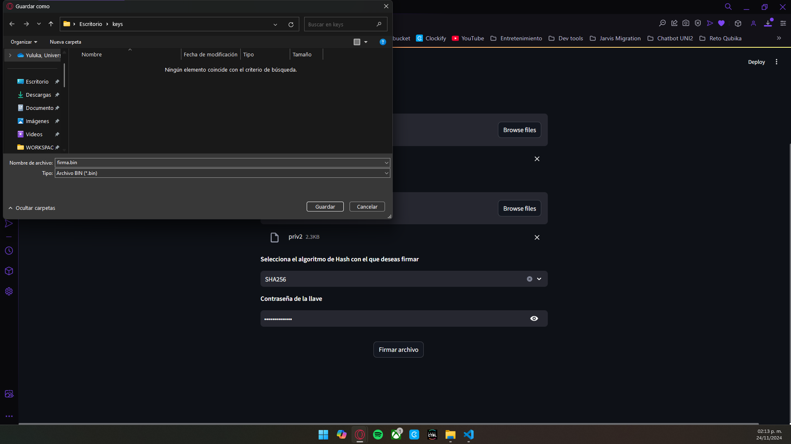

    4. `Verificar firma`:

        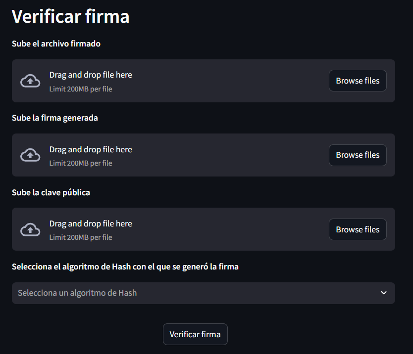

        In this tab you can validate if the signature of a file corresponds to a public key. In other words, you can validate if the owner of the private public key pair you are using is the one who signed the uploaded file.

        To do that, just upload the signed file, the generated signature, the public key, and select the same hash algorithm as the file was signed with. After that, press the button `Verificar firma`. The process will start and you will see a message indicating whether the signature is valid or not:

        

        


I hope you find this useful.